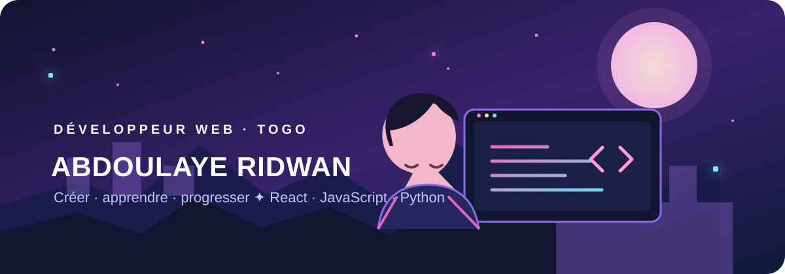

  

  <h1>Salut, moi c’est Abdoulaye Ridwan 👋</h1>
  <h3>Développeur web en apprentissage · React · JavaScript · Python</h3>

  

    J’apprends en construisant des projets utiles, en explorant le web et en progressant un commit à la fois ✨
  

  

---

## 🌸 À propos

- ⚛️ J’apprends **React** et les outils modernes du web.
- 🧩 Je travaille aussi avec **HTML, CSS, JavaScript** et **Python**.
- 🌱 J’aime transformer les idées en petits projets concrets.
- 🎯 Objectif : progresser régulièrement et écrire du code clair.

## 🛠️ Technologies

  
  
  
  
  

## 📊 Mes statistiques GitHub

  
  

## 🐍 Mes contributions

L’animation ci-dessous est générée à partir de mon calendrier GitHub réel. Le workflow la met à jour chaque jour.

<picture>
  <source media="(prefers-color-scheme: dark)" srcset="https://raw.githubusercontent.com/abdoulridwan2-commits/abdoulridwan2-commits/output/github-contribution-grid-snake-dark.svg" />
  <source media="(prefers-color-scheme: light)" srcset="https://raw.githubusercontent.com/abdoulridwan2-commits/abdoulridwan2-commits/output/github-contribution-grid-snake.svg" />
  
</picture>

---

  <i>« Petit à petit, le code devient une grande aventure. »</i>

